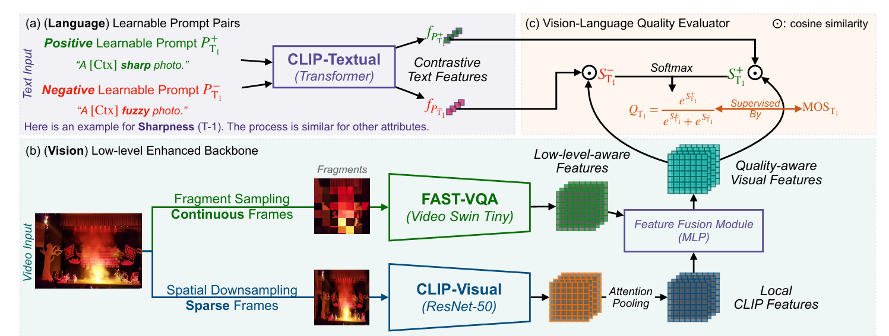

# Improved Video Quality Assessment with Chunkwise Training and Huber Loss

This repository implements a robust, scalable, and interpretable **Video Quality Assessment (VQA)** model using a multi-modal architecture that fuses visual, temporal, and textual signals. The model improves upon the FAST-VQA framework by introducing progressive enhancements like chunkwise training, deeper MLP architectures, dynamic learning rate scheduling, and Huber loss.

## 📌 Project Highlights

- 🔁 **Chunkwise Training** to reduce GPU memory footprint while enabling long-sequence modeling.
- 🧠 **Deep MLP Feature Fusion** for better representation of video distortions.
- 🔄 **CosineAnnealingWarmRestart** for adaptive learning rate optimization.
- ⚖️ **Huber Loss** integration to handle noisy human labels in subjective datasets.
- 🔍 **Explainable VQA** through CLIP-based vision-language alignment.

## 🏗️ System Architecture



The model has four main components:
- **Fast-VQA (Video Swin Tiny):** Captures temporal video features.
- **CLIP-Visual (ResNet-50):** Extracts semantic frame features.
- **CLIP-Textual (Transformer):** Encodes quality-related language prompts.
- **Feature Fusion Module (MLP):** Fuses multi-modal features and computes quality scores.

## 📊 Performance Comparison

| Model Improvements     | PLCC | SRCC |
|------------------------|------|------|
| Baseline (original)    | 0.72 | 0.69 |
| Chunkwise Training     | 0.76 | 0.72 |
| CosineAnnealing        | 0.79 | 0.75 |
| Deep MLP               | 0.81 | 0.77 |
| Huber Loss             | 0.83 | 0.79 |

## 📁 Dataset Used

- **Maxwell Dataset:** In-the-wild VQA dataset with 4,543 videos annotated across 16 quality dimensions.
- Features extracted using **FAST-VQA (via DOVER)** and **CLIP** models.
- Label supervision through **natural language prompts**.

## 🧪 Setup Instructions

### 1. Create Virtual Environment (optional)

```bash
python -m venv vqa_env
source vqa_env/bin/activate  # or use vqa_env\Scripts\activate on Windows
